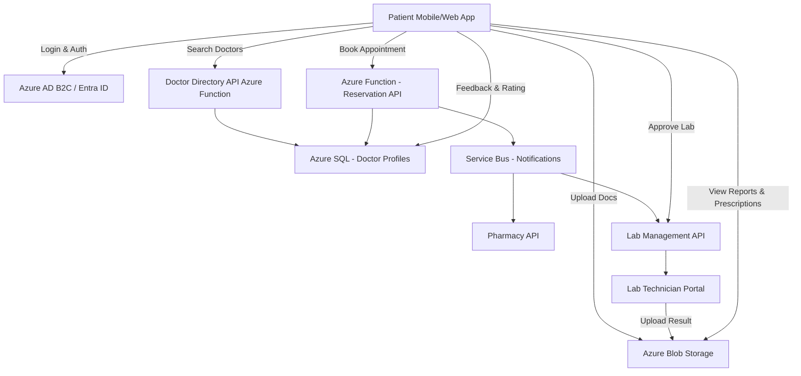

# Healthcare-App-Use-Case

Here’s a **detailed healthcare app use case** that captures your patient scenario — covering patient–doctor–pharmacy relationships, reservations, document uploads, and approvals for lab and service workflows.

---

## 🏥 Use Case: **SmartHealth – Patient Reservation & Care Coordination App**

### **1. Objective**

To provide patients with a seamless digital platform for booking medical appointments with doctors in their area, associating prescriptions with nearby pharmacies, uploading relevant medical documents, and approving lab work or additional medical services—all within a secure, HIPAA-compliant environment.

---

### **2. Actors**

| Role               | Description                                                                                           |
| ------------------ | ----------------------------------------------------------------------------------------------------- |
| **Patient**        | Primary user who searches doctors, makes reservations, uploads documents, and approves labs/services. |
| **Doctor**         | Provides consultation and updates lab/test orders, shares results with patients.                      |
| **Pharmacy**       | Fulfills prescriptions associated with patient visits or uploaded doctor notes.                       |
| **Lab Technician** | Manages lab requests, uploads results, and awaits patient approval.                                   |
| **System Admin**   | Maintains user access, audit trails, and ensures compliance and data integrity.                       |

---

### **3. Pre-Conditions**

* Patient has registered and verified their profile in the SmartHealth app.
* Patient location access is enabled to determine the nearest doctors and pharmacies.
* The system has integrated APIs for doctor scheduling, pharmacy networks, and lab management.

---

### **4. Main Flow**

1. **Login & Profile Setup**

   * Patient logs into the app using Entra ID / B2C or biometric authentication.
   * Patient profile includes demographics, medical history, preferred pharmacy, and insurance information.

2. **Search for Nearby Doctors**

   * The system uses patient’s geolocation to display a list of available doctors within a selected radius.
   * Filters include specialization, availability, telehealth option, ratings, and insurance acceptance.

3. **View Doctor Profile & Schedule Appointment**

   * Patient selects a doctor → views bio, certifications, reviews, and next available slots.
   * Patient books an appointment and receives confirmation via email, SMS, and app notification.

4. **Attach or Upload Documents**

   * Patient uploads relevant medical reports, prescriptions, or insurance documents (PDF, image, etc.).
   * Documents are stored securely in Azure Blob Storage linked with patient ID.

5. **Consultation & Prescription Handling**

   * Doctor completes the appointment and submits prescriptions through the app.
   * Patient reviews the prescription and selects a **nearest associated pharmacy** for fulfillment.
   * Prescription data is transmitted via API to the pharmacy partner system.

6. **Lab Work Request**

   * Doctor orders lab work based on consultation.
   * Patient receives a **Lab Approval Request Notification**.
   * Patient reviews details and **approves or declines** the lab service through the app.

7. **Result Delivery & Notifications**

   * Once lab results are uploaded by the lab, patient receives an alert.
   * Patient can view and download lab reports (secured and encrypted).

8. **Follow-up & Feedback**

   * Patient can schedule follow-up appointments or message the doctor.
   * Patients can rate and review the experience for quality assurance.

---

### **5. Post-Conditions**

* Appointment, prescription, and lab records are saved in Azure SQL with immutable audit trails.
* Pharmacy and lab integrations are updated with status changes via Azure Event Grid / Service Bus.
* Documents are tagged with metadata (patient ID, document type, date uploaded).

---

### **6. Key Features**

| Feature                         | Description                                                           |
| ------------------------------- | --------------------------------------------------------------------- |
| **Geo-based Doctor Search**     | Auto-detects nearby doctors using location services.                  |
| **Pharmacy Integration**        | Allows patient to link nearest pharmacies for prescriptions.          |
| **Secure Document Upload**      | Patients upload reports or IDs (stored in encrypted blob containers). |
| **Lab Work Approval Workflow**  | Patients review and approve labs before submission.                   |
| **Service & Feature Expansion** | Supports diagnostics, teleconsultation, and appointment rescheduling. |
| **Notifications & Reminders**   | Multi-channel updates via push, SMS, and email.                       |

---

### **7. System Architecture Overview**

---

### **8. Security & Compliance**

* **HIPAA Compliant** storage and transmission.
* **Azure Key Vault** to manage secrets and API keys.
* **RBAC & PIM** for controlled access to sensitive patient data.
* **Audit Logging** via Azure Monitor and Log Analytics.
* **Data Encryption** at rest (AES-256) and in transit (TLS 1.2+).

---

### **9. Possible Extensions**

* Integration with **Azure Health Data Services (FHIR)** for interoperability.
* AI-based **Doctor Recommendation Engine**.
* Integration with wearable IoT devices for vitals monitoring.
* **Power BI dashboard** for patient health trends and pharmacy analytics.

---

