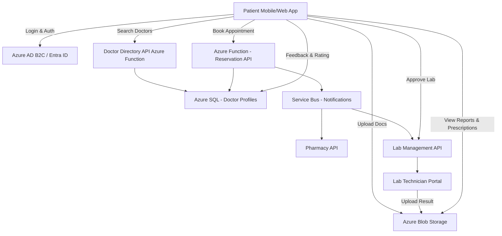
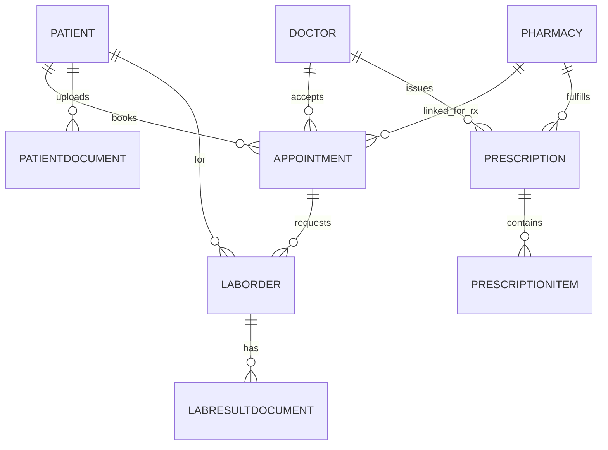

# Healthcare-App-Use-Case

Here’s a **detailed healthcare app use case** that captures your patient scenario — covering patient–doctor–pharmacy relationships, reservations, document uploads, and approvals for lab and service workflows.

---

## 🏥 Use Case: **SmartHealth – Patient Reservation & Care Coordination App**

### **1. Objective**

To provide patients with a seamless digital platform for booking medical appointments with doctors in their area, associating prescriptions with nearby pharmacies, uploading relevant medical documents, and approving lab work or additional medical services—all within a secure, HIPAA-compliant environment.

---

### **2. Actors**

| Role               | Description                                                                                           |
| ------------------ | ----------------------------------------------------------------------------------------------------- |
| **Patient**        | Primary user who searches doctors, makes reservations, uploads documents, and approves labs/services. |
| **Doctor**         | Provides consultation and updates lab/test orders, shares results with patients.                      |
| **Pharmacy**       | Fulfills prescriptions associated with patient visits or uploaded doctor notes.                       |
| **Lab Technician** | Manages lab requests, uploads results, and awaits patient approval.                                   |
| **System Admin**   | Maintains user access, audit trails, and ensures compliance and data integrity.                       |

---

### **3. Pre-Conditions**

* Patient has registered and verified their profile in the SmartHealth app.
* Patient location access is enabled to determine the nearest doctors and pharmacies.
* The system has integrated APIs for doctor scheduling, pharmacy networks, and lab management.

---

### **4. Main Flow**

1. **Login & Profile Setup**

   * Patient logs into the app using Entra ID / B2C or biometric authentication.
   * Patient profile includes demographics, medical history, preferred pharmacy, and insurance information.

2. **Search for Nearby Doctors**

   * The system uses patient’s geolocation to display a list of available doctors within a selected radius.
   * Filters include specialization, availability, telehealth option, ratings, and insurance acceptance.

3. **View Doctor Profile & Schedule Appointment**

   * Patient selects a doctor → views bio, certifications, reviews, and next available slots.
   * Patient books an appointment and receives confirmation via email, SMS, and app notification.

4. **Attach or Upload Documents**

   * Patient uploads relevant medical reports, prescriptions, or insurance documents (PDF, image, etc.).
   * Documents are stored securely in Azure Blob Storage linked with patient ID.

5. **Consultation & Prescription Handling**

   * Doctor completes the appointment and submits prescriptions through the app.
   * Patient reviews the prescription and selects a **nearest associated pharmacy** for fulfillment.
   * Prescription data is transmitted via API to the pharmacy partner system.

6. **Lab Work Request**

   * Doctor orders lab work based on consultation.
   * Patient receives a **Lab Approval Request Notification**.
   * Patient reviews details and **approves or declines** the lab service through the app.

7. **Result Delivery & Notifications**

   * Once lab results are uploaded by the lab, patient receives an alert.
   * Patient can view and download lab reports (secured and encrypted).

8. **Follow-up & Feedback**

   * Patient can schedule follow-up appointments or message the doctor.
   * Patients can rate and review the experience for quality assurance.

---

### **5. Post-Conditions**

* Appointment, prescription, and lab records are saved in Azure SQL with immutable audit trails.
* Pharmacy and lab integrations are updated with status changes via Azure Event Grid / Service Bus.
* Documents are tagged with metadata (patient ID, document type, date uploaded).

---

### **6. Key Features**

| Feature                         | Description                                                           |
| ------------------------------- | --------------------------------------------------------------------- |
| **Geo-based Doctor Search**     | Auto-detects nearby doctors using location services.                  |
| **Pharmacy Integration**        | Allows patient to link nearest pharmacies for prescriptions.          |
| **Secure Document Upload**      | Patients upload reports or IDs (stored in encrypted blob containers). |
| **Lab Work Approval Workflow**  | Patients review and approve labs before submission.                   |
| **Service & Feature Expansion** | Supports diagnostics, teleconsultation, and appointment rescheduling. |
| **Notifications & Reminders**   | Multi-channel updates via push, SMS, and email.                       |

---

### **7. System Architecture Overview**



---

Perfect, let’s build this out properly. Below is a **detailed relational data model + Azure SQL CRUD stored procedures** for the SmartHealth scenario.

I’ll cover:

* Core tables (Patient, Doctor, Pharmacy, Appointment, LabOrder)
* Supporting tables (Specialty, Document, Prescription, etc.)
* CRUD procs for each core entity (ready to drop into Azure SQL)

You can plug this straight into your architecture or IaC.

---

## 1️⃣ Logical Data Model (Core Entities)

### Core Relationships (simplified)



We’ll focus on:

* `Patient`
* `Doctor`
* `Pharmacy`
* `Appointment`
* `LabOrder` (lab work approval flow)
* Key supporting tables

---

## 2️⃣ Table Definitions (Azure SQL / T-SQL)

### 2.1 Patient

```sql
CREATE TABLE dbo.Patient (
    PatientId           INT IDENTITY(1,1) PRIMARY KEY,
    ExternalPatientRef  NVARCHAR(100) NULL,
    FirstName           NVARCHAR(100) NOT NULL,
    LastName            NVARCHAR(100) NOT NULL,
    DateOfBirth         DATE NULL,
    Gender              NVARCHAR(50) NULL,
    Email               NVARCHAR(256) NOT NULL,
    PhoneNumber         NVARCHAR(50) NULL,
    AddressLine1        NVARCHAR(200) NULL,
    AddressLine2        NVARCHAR(200) NULL,
    City                NVARCHAR(100) NULL,
    State               NVARCHAR(100) NULL,
    ZipCode             NVARCHAR(20) NULL,
    PreferredPharmacyId INT NULL,
    IsActive            BIT NOT NULL DEFAULT (1),
    CreatedAtUtc        DATETIME2(3) NOT NULL DEFAULT (SYSUTCDATETIME()),
    UpdatedAtUtc        DATETIME2(3) NULL
);
GO

CREATE INDEX IX_Patient_Email ON dbo.Patient (Email);
```

---

### 2.2 Doctor

```sql
CREATE TABLE dbo.Doctor (
    DoctorId        INT IDENTITY(1,1) PRIMARY KEY,
    NpiNumber       NVARCHAR(50) NULL,
    FirstName       NVARCHAR(100) NOT NULL,
    LastName        NVARCHAR(100) NOT NULL,
    Specialty       NVARCHAR(100) NOT NULL,
    Email           NVARCHAR(256) NOT NULL,
    PhoneNumber     NVARCHAR(50) NULL,
    AddressLine1    NVARCHAR(200) NULL,
    AddressLine2    NVARCHAR(200) NULL,
    City            NVARCHAR(100) NULL,
    State           NVARCHAR(100) NULL,
    ZipCode         NVARCHAR(20) NULL,
    Latitude        DECIMAL(9,6) NULL,
    Longitude       DECIMAL(9,6) NULL,
    IsTelehealth    BIT NOT NULL DEFAULT (0),
    IsActive        BIT NOT NULL DEFAULT (1),
    CreatedAtUtc    DATETIME2(3) NOT NULL DEFAULT (SYSUTCDATETIME()),
    UpdatedAtUtc    DATETIME2(3) NULL
);
GO

CREATE INDEX IX_Doctor_City_Specialty ON dbo.Doctor (City, State, Specialty);
```

---

### 2.3 Pharmacy

```sql
CREATE TABLE dbo.Pharmacy (
    PharmacyId     INT IDENTITY(1,1) PRIMARY KEY,
    Name           NVARCHAR(200) NOT NULL,
    Email          NVARCHAR(256) NULL,
    PhoneNumber    NVARCHAR(50) NULL,
    AddressLine1   NVARCHAR(200) NOT NULL,
    AddressLine2   NVARCHAR(200) NULL,
    City           NVARCHAR(100) NOT NULL,
    State          NVARCHAR(100) NOT NULL,
    ZipCode        NVARCHAR(20) NOT NULL,
    Latitude       DECIMAL(9,6) NULL,
    Longitude      DECIMAL(9,6) NULL,
    Is24Hours      BIT NOT NULL DEFAULT (0),
    IsActive       BIT NOT NULL DEFAULT (1),
    CreatedAtUtc   DATETIME2(3) NOT NULL DEFAULT (SYSUTCDATETIME()),
    UpdatedAtUtc   DATETIME2(3) NULL
);
GO

CREATE INDEX IX_Pharmacy_Location ON dbo.Pharmacy (City, State, ZipCode);
```

---

### 2.4 Appointment

Represents reservations with doctors and optional pharmacy association.

```sql
CREATE TABLE dbo.Appointment (
    AppointmentId        INT IDENTITY(1,1) PRIMARY KEY,
    PatientId            INT NOT NULL,
    DoctorId             INT NOT NULL,
    PharmacyId           INT NULL,  -- For prescription routing
    AppointmentDateTime  DATETIME2(3) NOT NULL,
    DurationMinutes      INT NOT NULL DEFAULT (30),
    AppointmentType      NVARCHAR(50) NOT NULL, -- InPerson / Telehealth / FollowUp
    Status               NVARCHAR(50) NOT NULL, -- Requested / Confirmed / Completed / Cancelled / NoShow
    ReasonForVisit       NVARCHAR(500) NULL,
    Notes                NVARCHAR(MAX) NULL,
    CreatedAtUtc         DATETIME2(3) NOT NULL DEFAULT (SYSUTCDATETIME()),
    UpdatedAtUtc         DATETIME2(3) NULL,
    CONSTRAINT FK_Appointment_Patient
        FOREIGN KEY (PatientId) REFERENCES dbo.Patient(PatientId),
    CONSTRAINT FK_Appointment_Doctor
        FOREIGN KEY (DoctorId) REFERENCES dbo.Doctor(DoctorId),
    CONSTRAINT FK_Appointment_Pharmacy
        FOREIGN KEY (PharmacyId) REFERENCES dbo.Pharmacy(PharmacyId)
);
GO

CREATE INDEX IX_Appointment_Patient ON dbo.Appointment (PatientId, AppointmentDateTime);
CREATE INDEX IX_Appointment_Doctor ON dbo.Appointment (DoctorId, AppointmentDateTime);
```

---

### 2.5 LabOrder

Captures lab work approval, status, and linkage to appointments.

```sql
CREATE TABLE dbo.LabOrder (
    LabOrderId             INT IDENTITY(1,1) PRIMARY KEY,
    AppointmentId          INT NOT NULL,
    PatientId              INT NOT NULL,
    OrderedByDoctorId      INT NOT NULL,
    LabName                NVARCHAR(200) NULL,
    OrderDetails           NVARCHAR(MAX) NOT NULL,
    Status                 NVARCHAR(50) NOT NULL, -- PendingApproval / Approved / Rejected / InProgress / Completed
    PatientApproved        BIT NOT NULL DEFAULT (0),
    PatientApprovedAtUtc   DATETIME2(3) NULL,
    RejectionReason        NVARCHAR(500) NULL,
    CreatedAtUtc           DATETIME2(3) NOT NULL DEFAULT (SYSUTCDATETIME()),
    UpdatedAtUtc           DATETIME2(3) NULL,
    CONSTRAINT FK_LabOrder_Appointment
        FOREIGN KEY (AppointmentId) REFERENCES dbo.Appointment(AppointmentId),
    CONSTRAINT FK_LabOrder_Patient
        FOREIGN KEY (PatientId) REFERENCES dbo.Patient(PatientId),
    CONSTRAINT FK_LabOrder_Doctor
        FOREIGN KEY (OrderedByDoctorId) REFERENCES dbo.Doctor(DoctorId)
);
GO

CREATE INDEX IX_LabOrder_Patient ON dbo.LabOrder (PatientId, Status);
CREATE INDEX IX_LabOrder_Appointment ON dbo.LabOrder (AppointmentId);
```

---

### 2.6 PatientDocument (Document Uploads)

```sql
CREATE TABLE dbo.PatientDocument (
    DocumentId        INT IDENTITY(1,1) PRIMARY KEY,
    PatientId         INT NOT NULL,
    AppointmentId     INT NULL,  -- optional, document tied to a visit
    LabOrderId        INT NULL,  -- optional, lab result
    FileName          NVARCHAR(255) NOT NULL,
    FileType          NVARCHAR(50) NOT NULL,  -- pdf, jpg, png, etc.
    BlobUrl           NVARCHAR(500) NOT NULL, -- SAS / path in Blob Storage
    DocumentType      NVARCHAR(100) NOT NULL, -- Report, ID, Insurance, LabResult, Prescription, etc.
    UploadedBy        NVARCHAR(100) NOT NULL, -- Patient / Doctor / Lab / System
    UploadedAtUtc     DATETIME2(3) NOT NULL DEFAULT (SYSUTCDATETIME()),
    IsActive          BIT NOT NULL DEFAULT (1),
    CONSTRAINT FK_PatientDocument_Patient
        FOREIGN KEY (PatientId) REFERENCES dbo.Patient(PatientId),
    CONSTRAINT FK_PatientDocument_Appointment
        FOREIGN KEY (AppointmentId) REFERENCES dbo.Appointment(AppointmentId),
    CONSTRAINT FK_PatientDocument_LabOrder
        FOREIGN KEY (LabOrderId) REFERENCES dbo.LabOrder(LabOrderId)
);
GO

CREATE INDEX IX_PatientDocument_Patient ON dbo.PatientDocument (PatientId, DocumentType);
```

---

## 3️⃣ CRUD Stored Procedures

I’ll keep each operation clean, production-ready, and consistent.

---

### 3.1 Patient – CRUD

#### Create Patient

```sql
CREATE OR ALTER PROCEDURE dbo.Patient_Create
(
    @FirstName          NVARCHAR(100),
    @LastName           NVARCHAR(100),
    @DateOfBirth        DATE = NULL,
    @Gender             NVARCHAR(50) = NULL,
    @Email              NVARCHAR(256),
    @PhoneNumber        NVARCHAR(50) = NULL,
    @AddressLine1       NVARCHAR(200) = NULL,
    @AddressLine2       NVARCHAR(200) = NULL,
    @City               NVARCHAR(100) = NULL,
    @State              NVARCHAR(100) = NULL,
    @ZipCode            NVARCHAR(20) = NULL,
    @PreferredPharmacyId INT = NULL
)
AS
BEGIN
    SET NOCOUNT ON;

    INSERT INTO dbo.Patient
    (
        FirstName, LastName, DateOfBirth, Gender, Email, PhoneNumber,
        AddressLine1, AddressLine2, City, State, ZipCode,
        PreferredPharmacyId
    )
    VALUES
    (
        @FirstName, @LastName, @DateOfBirth, @Gender, @Email, @PhoneNumber,
        @AddressLine1, @AddressLine2, @City, @State, @ZipCode,
        @PreferredPharmacyId
    );

    SELECT SCOPE_IDENTITY() AS PatientId;
END;
GO
```

#### Read Patient (by Id)

```sql
CREATE OR ALTER PROCEDURE dbo.Patient_GetById
(
    @PatientId INT
)
AS
BEGIN
    SET NOCOUNT ON;

    SELECT *
    FROM dbo.Patient
    WHERE PatientId = @PatientId
      AND IsActive = 1;
END;
GO
```

#### Update Patient

```sql
CREATE OR ALTER PROCEDURE dbo.Patient_Update
(
    @PatientId          INT,
    @FirstName          NVARCHAR(100),
    @LastName           NVARCHAR(100),
    @DateOfBirth        DATE = NULL,
    @Gender             NVARCHAR(50) = NULL,
    @Email              NVARCHAR(256),
    @PhoneNumber        NVARCHAR(50) = NULL,
    @AddressLine1       NVARCHAR(200) = NULL,
    @AddressLine2       NVARCHAR(200) = NULL,
    @City               NVARCHAR(100) = NULL,
    @State              NVARCHAR(100) = NULL,
    @ZipCode            NVARCHAR(20) = NULL,
    @PreferredPharmacyId INT = NULL
)
AS
BEGIN
    SET NOCOUNT ON;

    UPDATE dbo.Patient
    SET FirstName          = @FirstName,
        LastName           = @LastName,
        DateOfBirth        = @DateOfBirth,
        Gender             = @Gender,
        Email              = @Email,
        PhoneNumber        = @PhoneNumber,
        AddressLine1       = @AddressLine1,
        AddressLine2       = @AddressLine2,
        City               = @City,
        State              = @State,
        ZipCode            = @ZipCode,
        PreferredPharmacyId = @PreferredPharmacyId,
        UpdatedAtUtc       = SYSUTCDATETIME()
    WHERE PatientId = @PatientId
      AND IsActive = 1;
END;
GO
```

#### Soft Delete Patient

```sql
CREATE OR ALTER PROCEDURE dbo.Patient_Delete
(
    @PatientId INT
)
AS
BEGIN
    SET NOCOUNT ON;

    UPDATE dbo.Patient
    SET IsActive = 0,
        UpdatedAtUtc = SYSUTCDATETIME()
    WHERE PatientId = @PatientId;
END;
GO
```

---

### 3.2 Doctor – CRUD

```sql
CREATE OR ALTER PROCEDURE dbo.Doctor_Create
(
    @NpiNumber      NVARCHAR(50) = NULL,
    @FirstName      NVARCHAR(100),
    @LastName       NVARCHAR(100),
    @Specialty      NVARCHAR(100),
    @Email          NVARCHAR(256),
    @PhoneNumber    NVARCHAR(50) = NULL,
    @AddressLine1   NVARCHAR(200) = NULL,
    @AddressLine2   NVARCHAR(200) = NULL,
    @City           NVARCHAR(100) = NULL,
    @State          NVARCHAR(100) = NULL,
    @ZipCode        NVARCHAR(20) = NULL,
    @IsTelehealth   BIT = 0
)
AS
BEGIN
    SET NOCOUNT ON;

    INSERT INTO dbo.Doctor
    (
        NpiNumber, FirstName, LastName, Specialty, Email, PhoneNumber,
        AddressLine1, AddressLine2, City, State, ZipCode, IsTelehealth
    )
    VALUES
    (
        @NpiNumber, @FirstName, @LastName, @Specialty, @Email, @PhoneNumber,
        @AddressLine1, @AddressLine2, @City, @State, @ZipCode, @IsTelehealth
    );

    SELECT SCOPE_IDENTITY() AS DoctorId;
END;
GO
```

```sql
CREATE OR ALTER PROCEDURE dbo.Doctor_GetById
(
    @DoctorId INT
)
AS
BEGIN
    SET NOCOUNT ON;

    SELECT *
    FROM dbo.Doctor
    WHERE DoctorId = @DoctorId
      AND IsActive = 1;
END;
GO
```

```sql
CREATE OR ALTER PROCEDURE dbo.Doctor_Update
(
    @DoctorId      INT,
    @NpiNumber     NVARCHAR(50) = NULL,
    @FirstName     NVARCHAR(100),
    @LastName      NVARCHAR(100),
    @Specialty     NVARCHAR(100),
    @Email         NVARCHAR(256),
    @PhoneNumber   NVARCHAR(50) = NULL,
    @AddressLine1  NVARCHAR(200) = NULL,
    @AddressLine2  NVARCHAR(200) = NULL,
    @City          NVARCHAR(100) = NULL,
    @State         NVARCHAR(100) = NULL,
    @ZipCode       NVARCHAR(20) = NULL,
    @IsTelehealth  BIT = 0
)
AS
BEGIN
    SET NOCOUNT ON;

    UPDATE dbo.Doctor
    SET NpiNumber   = @NpiNumber,
        FirstName   = @FirstName,
        LastName    = @LastName,
        Specialty   = @Specialty,
        Email       = @Email,
        PhoneNumber = @PhoneNumber,
        AddressLine1 = @AddressLine1,
        AddressLine2 = @AddressLine2,
        City        = @City,
        State       = @State,
        ZipCode     = @ZipCode,
        IsTelehealth= @IsTelehealth,
        UpdatedAtUtc= SYSUTCDATETIME()
    WHERE DoctorId = @DoctorId
      AND IsActive = 1;
END;
GO
```

```sql
CREATE OR ALTER PROCEDURE dbo.Doctor_Delete
(
    @DoctorId INT
)
AS
BEGIN
    SET NOCOUNT ON;

    UPDATE dbo.Doctor
    SET IsActive = 0,
        UpdatedAtUtc = SYSUTCDATETIME()
    WHERE DoctorId = @DoctorId;
END;
GO
```

---

### 3.3 Pharmacy – CRUD

```sql
CREATE OR ALTER PROCEDURE dbo.Pharmacy_Create
(
    @Name          NVARCHAR(200),
    @Email         NVARCHAR(256) = NULL,
    @PhoneNumber   NVARCHAR(50) = NULL,
    @AddressLine1  NVARCHAR(200),
    @AddressLine2  NVARCHAR(200) = NULL,
    @City          NVARCHAR(100),
    @State         NVARCHAR(100),
    @ZipCode       NVARCHAR(20),
    @Is24Hours     BIT = 0
)
AS
BEGIN
    SET NOCOUNT ON;

    INSERT INTO dbo.Pharmacy
    (
        Name, Email, PhoneNumber, AddressLine1, AddressLine2,
        City, State, ZipCode, Is24Hours
    )
    VALUES
    (
        @Name, @Email, @PhoneNumber, @AddressLine1, @AddressLine2,
        @City, @State, @ZipCode, @Is24Hours
    );

    SELECT SCOPE_IDENTITY() AS PharmacyId;
END;
GO
```

```sql
CREATE OR ALTER PROCEDURE dbo.Pharmacy_GetById
(
    @PharmacyId INT
)
AS
BEGIN
    SET NOCOUNT ON;

    SELECT *
    FROM dbo.Pharmacy
    WHERE PharmacyId = @PharmacyId
      AND IsActive = 1;
END;
GO
```

```sql
CREATE OR ALTER PROCEDURE dbo.Pharmacy_Update
(
    @PharmacyId   INT,
    @Name         NVARCHAR(200),
    @Email        NVARCHAR(256) = NULL,
    @PhoneNumber  NVARCHAR(50) = NULL,
    @AddressLine1 NVARCHAR(200),
    @AddressLine2 NVARCHAR(200) = NULL,
    @City         NVARCHAR(100),
    @State        NVARCHAR(100),
    @ZipCode      NVARCHAR(20),
    @Is24Hours    BIT = 0
)
AS
BEGIN
    SET NOCOUNT ON;

    UPDATE dbo.Pharmacy
    SET Name         = @Name,
        Email        = @Email,
        PhoneNumber  = @PhoneNumber,
        AddressLine1 = @AddressLine1,
        AddressLine2 = @AddressLine2,
        City         = @City,
        State        = @State,
        ZipCode      = @ZipCode,
        Is24Hours    = @Is24Hours,
        UpdatedAtUtc = SYSUTCDATETIME()
    WHERE PharmacyId = @PharmacyId
      AND IsActive = 1;
END;
GO
```

```sql
CREATE OR ALTER PROCEDURE dbo.Pharmacy_Delete
(
    @PharmacyId INT
)
AS
BEGIN
    SET NOCOUNT ON;

    UPDATE dbo.Pharmacy
    SET IsActive = 0,
        UpdatedAtUtc = SYSUTCDATETIME()
    WHERE PharmacyId = @PharmacyId;
END;
GO
```

---

### 3.4 Appointment – CRUD

#### Create Appointment

```sql
CREATE OR ALTER PROCEDURE dbo.Appointment_Create
(
    @PatientId           INT,
    @DoctorId            INT,
    @PharmacyId          INT = NULL,
    @AppointmentDateTime DATETIME2(3),
    @DurationMinutes     INT = 30,
    @AppointmentType     NVARCHAR(50),
    @ReasonForVisit      NVARCHAR(500) = NULL
)
AS
BEGIN
    SET NOCOUNT ON;

    INSERT INTO dbo.Appointment
    (
        PatientId, DoctorId, PharmacyId,
        AppointmentDateTime, DurationMinutes,
        AppointmentType, Status, ReasonForVisit
    )
    VALUES
    (
        @PatientId, @DoctorId, @PharmacyId,
        @AppointmentDateTime, @DurationMinutes,
        @AppointmentType, 'Requested', @ReasonForVisit
    );

    SELECT SCOPE_IDENTITY() AS AppointmentId;
END;
GO
```

#### Get Appointment (by Id)

```sql
CREATE OR ALTER PROCEDURE dbo.Appointment_GetById
(
    @AppointmentId INT
)
AS
BEGIN
    SET NOCOUNT ON;

    SELECT a.*, p.FirstName AS PatientFirstName, p.LastName AS PatientLastName,
           d.FirstName AS DoctorFirstName, d.LastName AS DoctorLastName
    FROM dbo.Appointment a
    JOIN dbo.Patient p ON a.PatientId = p.PatientId
    JOIN dbo.Doctor d ON a.DoctorId = d.DoctorId
    WHERE a.AppointmentId = @AppointmentId;
END;
GO
```

#### Update Appointment (status/metadata)

```sql
CREATE OR ALTER PROCEDURE dbo.Appointment_Update
(
    @AppointmentId       INT,
    @PharmacyId          INT = NULL,
    @AppointmentDateTime DATETIME2(3) = NULL,
    @DurationMinutes     INT = NULL,
    @AppointmentType     NVARCHAR(50) = NULL,
    @Status              NVARCHAR(50) = NULL,
    @ReasonForVisit      NVARCHAR(500) = NULL,
    @Notes               NVARCHAR(MAX) = NULL
)
AS
BEGIN
    SET NOCOUNT ON;

    UPDATE dbo.Appointment
    SET PharmacyId          = ISNULL(@PharmacyId, PharmacyId),
        AppointmentDateTime = ISNULL(@AppointmentDateTime, AppointmentDateTime),
        DurationMinutes     = ISNULL(@DurationMinutes, DurationMinutes),
        AppointmentType     = ISNULL(@AppointmentType, AppointmentType),
        Status              = ISNULL(@Status, Status),
        ReasonForVisit      = ISNULL(@ReasonForVisit, ReasonForVisit),
        Notes               = ISNULL(@Notes, Notes),
        UpdatedAtUtc        = SYSUTCDATETIME()
    WHERE AppointmentId = @AppointmentId;
END;
GO
```

#### Cancel Appointment

```sql
CREATE OR ALTER PROCEDURE dbo.Appointment_Cancel
(
    @AppointmentId INT,
    @Reason        NVARCHAR(500) = NULL
)
AS
BEGIN
    SET NOCOUNT ON;

    UPDATE dbo.Appointment
    SET Status       = 'Cancelled',
        Notes        = CONCAT(ISNULL(Notes, ''), CHAR(13)+CHAR(10), 'Cancelled: ', ISNULL(@Reason, 'No reason provided')),
        UpdatedAtUtc = SYSUTCDATETIME()
    WHERE AppointmentId = @AppointmentId;
END;
GO
```

---

### 3.5 LabOrder – CRUD & Patient Approval

#### Create LabOrder (by Doctor)

```sql
CREATE OR ALTER PROCEDURE dbo.LabOrder_Create
(
    @AppointmentId     INT,
    @PatientId         INT,
    @OrderedByDoctorId INT,
    @LabName           NVARCHAR(200) = NULL,
    @OrderDetails      NVARCHAR(MAX)
)
AS
BEGIN
    SET NOCOUNT ON;

    INSERT INTO dbo.LabOrder
    (
        AppointmentId, PatientId, OrderedByDoctorId,
        LabName, OrderDetails, Status
    )
    VALUES
    (
        @AppointmentId, @PatientId, @OrderedByDoctorId,
        @LabName, @OrderDetails, 'PendingApproval'
    );

    SELECT SCOPE_IDENTITY() AS LabOrderId;
END;
GO
```

#### Get LabOrder (by Id)

```sql
CREATE OR ALTER PROCEDURE dbo.LabOrder_GetById
(
    @LabOrderId INT
)
AS
BEGIN
    SET NOCOUNT ON;

    SELECT lo.*, p.FirstName AS PatientFirstName, p.LastName AS PatientLastName,
           d.FirstName AS DoctorFirstName, d.LastName AS DoctorLastName
    FROM dbo.LabOrder lo
    JOIN dbo.Patient p ON lo.PatientId = p.PatientId
    JOIN dbo.Doctor d ON lo.OrderedByDoctorId = d.DoctorId
    WHERE lo.LabOrderId = @LabOrderId;
END;
GO
```

#### Patient Approves LabOrder

```sql
CREATE OR ALTER PROCEDURE dbo.LabOrder_Approve
(
    @LabOrderId INT,
    @PatientId  INT
)
AS
BEGIN
    SET NOCOUNT ON;

    UPDATE dbo.LabOrder
    SET Status               = 'Approved',
        PatientApproved      = 1,
        PatientApprovedAtUtc = SYSUTCDATETIME(),
        UpdatedAtUtc         = SYSUTCDATETIME()
    WHERE LabOrderId = @LabOrderId
      AND PatientId = @PatientId
      AND Status = 'PendingApproval';
END;
GO
```

#### Patient Rejects LabOrder

```sql
CREATE OR ALTER PROCEDURE dbo.LabOrder_Reject
(
    @LabOrderId     INT,
    @PatientId      INT,
    @RejectionReason NVARCHAR(500) = NULL
)
AS
BEGIN
    SET NOCOUNT ON;

    UPDATE dbo.LabOrder
    SET Status          = 'Rejected',
        PatientApproved = 0,
        RejectionReason = @RejectionReason,
        UpdatedAtUtc    = SYSUTCDATETIME()
    WHERE LabOrderId = @LabOrderId
      AND PatientId = @PatientId
      AND Status = 'PendingApproval';
END;
GO
```

#### Update LabOrder Status (Backend / Lab System)

```sql
CREATE OR ALTER PROCEDURE dbo.LabOrder_UpdateStatus
(
    @LabOrderId INT,
    @Status     NVARCHAR(50)
)
AS
BEGIN
    SET NOCOUNT ON;

    UPDATE dbo.LabOrder
    SET Status       = @Status,
        UpdatedAtUtc = SYSUTCDATETIME()
    WHERE LabOrderId = @LabOrderId;
END;
GO
```

